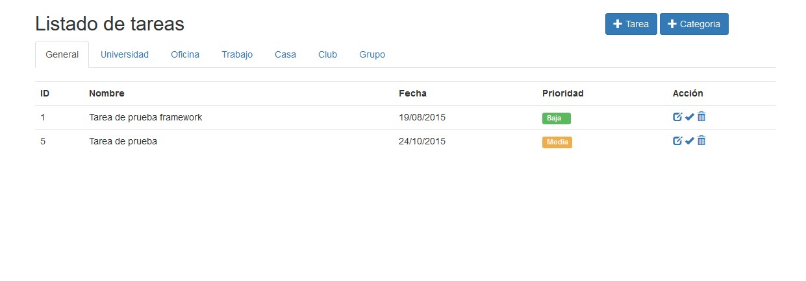

#Sistema de Gestión de tareas

Sistema para el manejo de tereas pendientes clasificadas por categorías.

Tecnologías web usadas:
- Php 5.6.3
- MySQL 5.6.21
- Extensión PDO
- Bootstrap v3.3.5

Sistema de ejemplo para la materia de desarrollo de aplicaciones web, favor de no usar en modo producción.

##Instalación

1. Para instalar la aplicación, clónala con Git Bash dentro de la carpeta htdocs con la siguiente instrucción: git clone https://github.com/crisbera/Gestion.git gestion 
Debe quedar algo como htdocs/gestion.

2. Crea una base de datos llamada gestion desde phpmyadmin.
3. Importa el archivo de la base de datos ubicado en gestion/docs/database/estructura.sql en tu gestor de base de datos MySQL.
4. Inserta los datos de configuración según tu servidor en aplication/config.php
5. Invoca la aplicación desde http://localhost/gestion

**Importante**

La carpeta de la aplicación debe llamarse gestion y debe estar en htdocs, si la cambias favor de modificar el archivo index.php principal y cambiar el valor de la constante APP_FOLDER por el nombre de la carpeta deseada.

Cambia eso define("APP_FOLDER", "gestion"); por define("APP_FOLDER", "nombre_carpeta");

Existe un usuario por defecto:

Usuario: admin | Contraseña: admin